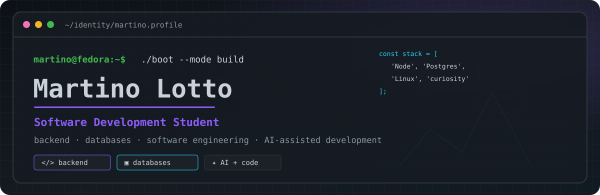
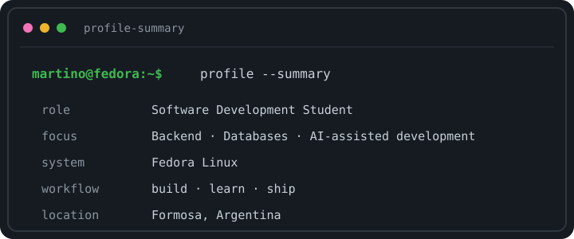
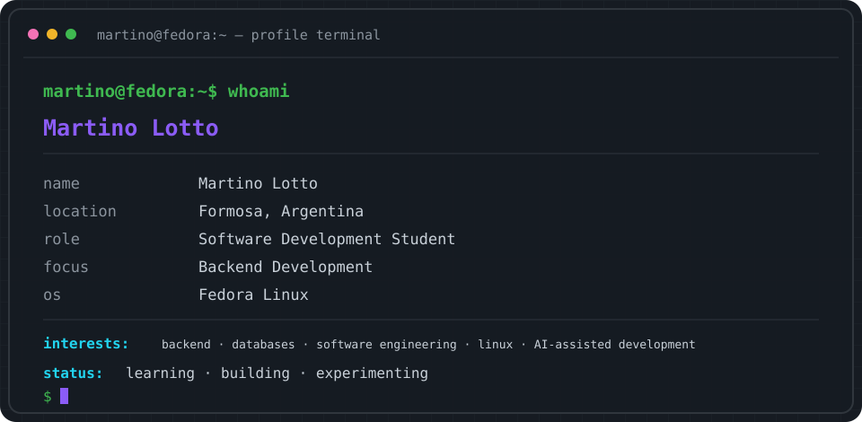
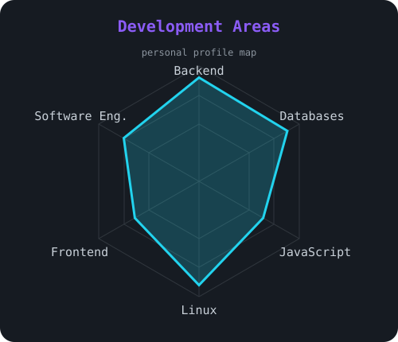
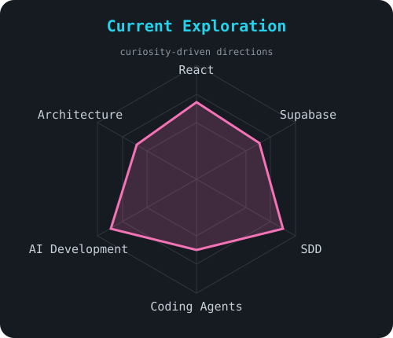
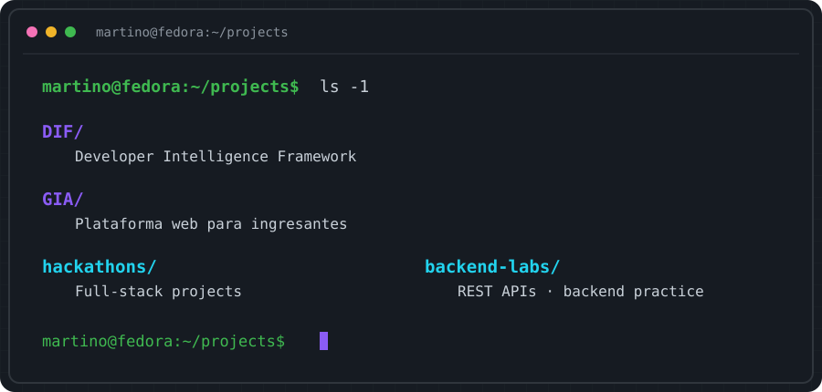
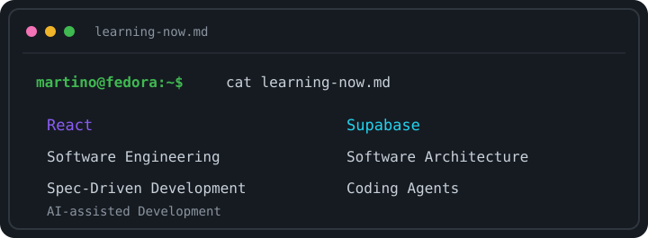

<a href="https://github.com/Martinolotto" title="GitHub de Martino Lotto">
  <picture>
    <source media="(prefers-color-scheme: dark)" srcset="assets/banner-dark.svg">
    <source media="(prefers-color-scheme: light)" srcset="assets/banner-light.svg">
    
  </picture>
</a>

  

  

---

## `$ whoami`

  

---

## `$ cat tech-stack.yaml`

<table>
  <tr>
    <td width="50%" valign="top">
      <code>├─ ◈ languages_frontend:</code>  
       
      <code>JavaScript · HTML · CSS · React · Vite · Tailwind CSS</code>
    </td>
    <td width="50%" valign="top">
      <code>├─ ◉ backend:</code>  
       
      <code>Node.js · Express · REST APIs · Sequelize · C</code>
    </td>
  </tr>
  <tr>
    <td width="50%" valign="top">
      <code>├─ ▣ databases_backend:</code>  
       
      <code>PostgreSQL · MySQL · MongoDB · Supabase</code>
    </td>
    <td width="50%" valign="top">
      <code>├─ ◌ environment_containers:</code>  
      &nbsp;
       
      <code>Fedora · Linux · Git · GitHub · Docker · Podman</code>
    </td>
  </tr>
  <tr>
    <td width="50%" valign="top">
      <code>├─ ↗ deploy_workflow:</code>  
      &nbsp;
      &nbsp;
       
      <code>Render · Vercel · Cloudflare · Bash · Fish</code>
    </td>
    <td width="50%" valign="top">
      <code>╰─ ✦ ai_development:</code>  
      &nbsp;
      &nbsp;
      &nbsp;
       
      <code>ChatGPT · Codex · Claude Code · Ollama · NotebookLM</code>
    </td>
  </tr>
</table>

<code>martino@fedora:~$ status --learning --building --shipping</code>

---

## `$ ./profile --signals`

  <picture><source media="(prefers-color-scheme: dark)" srcset="assets/radar-dark.svg"><source media="(prefers-color-scheme: light)" srcset="assets/radar-light.svg"></picture>
  &nbsp;&nbsp;
  <picture><source media="(prefers-color-scheme: dark)" srcset="assets/radar-langs-dark.svg"><source media="(prefers-color-scheme: light)" srcset="assets/radar-langs-light.svg"></picture>

<code>personal signals · interests in motion · not a skills scorecard</code>

---

## `$ ls ~/projects`

---

## `$ cat learning-now.md`

---

## `$ connect --socials`

&nbsp;&nbsp;&nbsp;

<code>Formosa, Argentina · Linux · code · curiosity · keep shipping</code>

